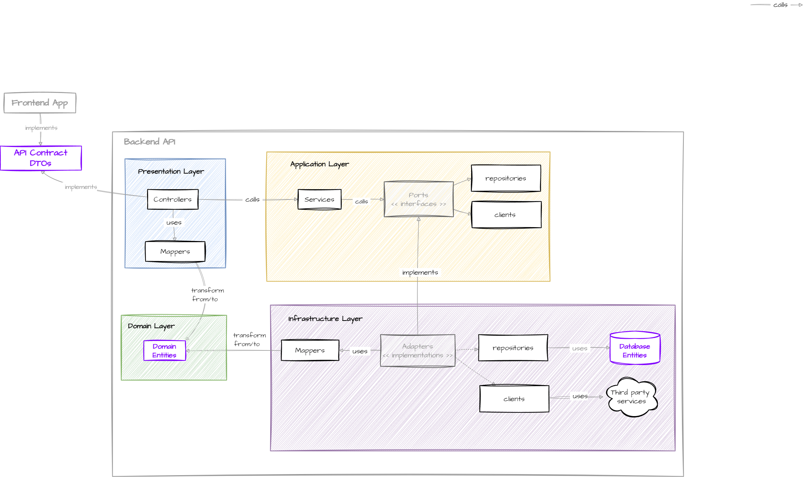

# ADR 0001: REST API Architecture 🏗️

## Status
Accepted ✅

## Context
Need for a scalable and maintainable REST API architecture that enables efficient task and project management.

## Decision
Implement a pragmatic layered architecture inspired by Hexagonal Architecture:

### Monolithic Modular Approach 🏰
We have chosen to implement a modular monolithic architecture as our initial approach for several reasons:

#### Why Monolithic?
- We are developing a product from scratch, and premature optimization could lead to unnecessary complexity
- The current scale and requirements don't justify the overhead of distributed systems
- Faster development cycles and simpler deployment process
- Easier debugging and monitoring
- Lower operational costs during early stages

#### Modular Design Benefits 🧩
Our modular approach provides several advantages:
- Clear boundaries between features through self-contained modules
- Each module encapsulates its own domain logic, infrastructure, and presentation
- Easier to maintain and test individual components
- Natural alignment with Domain-Driven Design (DDD) principles:
  - Each module represents a bounded context
  - Clear domain boundaries within modules
  - Rich domain models within each module
  - Explicit interfaces between modules

#### Future Evolution Path 🚀
While we start with a modular monolith, our architecture is designed to evolve:
- CQRS: Can be implemented at the module level when needed
- Event-Driven: Can be gradually introduced through event sourcing
- Microservices: Modules can be extracted into microservices if scaling requirements demand it

The key is to maintain a pragmatic balance between current needs and future flexibility.

### Core Principles
- Domain Layer: Core business entities and domain logic (innermost layer)
- Application Layer: Business services and ports (orchestrates domain operations)
- Infrastructure Layer: External implementations (database, external services)
- Presentation Layer: Controllers and mappers (handles HTTP requests)
- Shared Contracts: Frontend-Backend communication (`@rebeca-hexagonal-nest-template/api-contract`)
- Dependency Injection: NestJS DI for loose coupling between layers

### Decision Rationale 🎯
Our architectural decisions are driven by several key considerations:

#### Why Hexagonal Architecture?
- Provides clear boundaries between business logic and external concerns
- Enables easy testing through port abstractions
- Allows for flexible infrastructure changes without affecting core business logic
- Aligns well with our modular monolith approach

#### Why NestJS?
- Built-in support for dependency injection and modular architecture
- Strong TypeScript integration
- Excellent developer experience and documentation
- Active community and regular updates
- Built-in support for OpenAPI/Swagger

#### Why Shared Contracts?
- Type safety across the entire stack
- Enables parallel frontend/backend development
- Single source of truth for API contracts
- Reduces integration issues
- Better developer experience with autocompletion

#### Why PostgreSQL?
- ACID compliance for data integrity
- Strong community and ecosystem
- Excellent performance for our scale
- Rich feature set including JSON support
- Cost-effective for our current needs

#### Why TypeORM?
- Native TypeScript support
- Active query builder
- Rich feature set
- Good balance between features and complexity
- Strong integration with NestJS

### Architecture Overview


### Module Structure
```
modules/
  ├── feature/             # Feature module
  │   ├── domain/          # Business entities
  │   ├── application/     # Business logic
  │   ├── infrastructure/  # External implementations
  │   └── presentation/    # Controllers
  ├── shared/             # Shared modules
  └── root/              # Root module
```

### Shared Contracts
The communication between frontend and backend is handled through the `@rebeca-hexagonal-nest-template/api-contract` package:
- Contains DTOs for requests and responses
- Ensures type safety across the entire application
- Enables parallel development
- Shared between frontend and backend projects

### Implementation Examples

#### Presentation Layer 🎨
```typescript
// @rebeca-hexagonal-nest-template/api-contract
export class TaskRequest {
  public title!: string;
  public description!: string;
}

export class TaskResponse {
  public id!: number;
  public title!: string;
  public description!: string;
}

// presentation/task.controller.ts
export class TaskController {
  public constructor(private readonly taskService: TaskService) {}

  @Get()
  public async getTasks(): Promise<TaskResponse[]> {
    const tasks = await this.taskService.getTasks();
    return tasks.map((task) => TaskMapper.toResponse(task));
  }

  @Post()
  public async createTask(@Body() request: TaskRequest): Promise<TaskResponse> {
    const task = await this.taskService.createTask(request.title, request.description);
    return TaskMapper.toResponse(task);
  }
}

// presentation/mappers/task.mapper.ts
export class TaskMapper {
  public static toResponse(task: Task): TaskResponse {
    const response = new TaskResponse();
    response.id = task.id;
    response.title = task.title;
    response.description = task.description;
    return response;
  }
}
```

#### Application Layer 🔌
```typescript
// application/ports/task.repository.ts
export interface TaskRepository {
  getTasks(): Promise<Task[]>;
  getTask(id: number): Promise<Task>;
  createTask(title: string, description: string): Promise<Task>;
  updateTask(id: number, title: string, description: string): Promise<Task>;
  deleteTask(id: number): Promise<void>;
}

// application/task.service.ts
@Injectable()
export class TaskService {
  public constructor(@Inject(TASK_REPOSITORY) private readonly taskRepository: TaskRepository) {}

  public async getTasks(): Promise<Task[]> {
    return this.taskRepository.getTasks();
  }

  public async createTask(title: string, description: string): Promise<Task> {
    return this.taskRepository.createTask(title, description);
  }
}
```

#### Infrastructure Layer 🔧
```typescript
// infrastructure/repositories/task.repository.adapter.ts
@Injectable()
export class TaskRepositoryAdapter implements TaskRepository {
  public constructor(
    @InjectRepository(Task)
    private readonly repository: Repository<Task>
  ) {}

  public async getTasks(): Promise<Task[]> {
    return this.repository.find();
  }

  public async createTask(title: string, description: string): Promise<Task> {
    const task = this.repository.create({ title, description });
    return this.repository.save(task);
  }
}

// infrastructure/repositories/task.repository.provider.ts
export const taskRepositoryProviders = [
  {
    provide: TASK_REPOSITORY,
    useClass: TaskRepositoryAdapter
  }
];
```

#### Domain Layer 🎯
```typescript
// domain/task.ts
export class Task {
  public id!: number;
  public title!: string;
  public description!: string;
}
```

### Tech Stack
- NestJS framework (v10+)
- TypeScript (strict mode)
- PostgreSQL (v15+)
- TypeORM (v0.3+)
- OpenAPI/Swagger (v7+) for automatic API documentation
- Shared contracts package (`@rebeca-hexagonal-nest-template/api-contract`)

### API Documentation 📚
The API documentation is automatically generated using OpenAPI/Swagger:
- Available at `http://localhost:3000/api` when `ENABLE_OPENAPI=true`
- Interactive documentation with request/response examples
- Integration with shared contracts (`@rebeca-hexagonal-nest-template/api-contract`)
- Examples automatically generated from mocks
- Authentication and authorization support
- Schema and model documentation

### Implementation Guidelines
- Use dependency injection for all dependencies
- Keep domain entities pure and framework-agnostic
- Implement ports (interfaces) in application layer
- Use adapters for external implementations
- Map between DTOs and domain entities in presentation layer
- Handle errors at appropriate layer:
  - Domain errors in domain layer
  - Application errors in application layer
  - HTTP errors in presentation layer
- Use shared contracts for all API communication
- Follow NestJS best practices for decorators and metadata

### Error Handling Strategy 🚨
Our error handling approach follows these principles:
- Domain errors are handled at the domain layer with rich domain models
- Application errors are transformed into appropriate HTTP responses
- Each layer has its own error types and handling mechanisms
- Errors are logged with appropriate context and severity
- Client receives meaningful error messages without exposing internal details

### Testing Strategy 🧪
We follow a comprehensive testing approach:
- Unit tests for domain logic and business rules
- Integration tests for application services and repositories
- E2E tests for critical user flows
- Test coverage requirements:
  - Domain layer: 100%
  - Application layer: 90%
  - Infrastructure layer: 80%
  - Presentation layer: 80%
- Mocking strategy:
  - Use interfaces for external dependencies
  - Mock repositories in service tests
  - Use test doubles for external services
  - Avoid mocking domain logic

## Consequences

### Positive ✨
- Clear separation of concerns
- Easy testing
- Flexible infrastructure
- Maintainable codebase
- Strong typing
- Automatic API docs with Swagger/OpenAPI
- Interactive API documentation with examples
- Self-documenting API through decorators
- Pragmatic approach
- Fast development cycles
- Type safety
- Parallel development

### Negative ⚠️
- Complex initial setup
- Additional boilerplate
- Learning curve
- Multiple layers to maintain
- Dependency management
- Architectural compromises
- Balance between structure and simplicity
- Shared contracts maintenance

## References 📚
- [NestJS Documentation](https://docs.nestjs.com/)
- [Hexagonal Architecture](https://alistair.cockburn.us/hexagonal-architecture/)
- [TypeScript Documentation](https://www.typescriptlang.org/docs/)
- [TypeORM Documentation](https://typeorm.io/)

## Note
This ADR was generated with Cursor's assistance, but the architecture and design were created with the magic of human creativity. The combination of artificial intelligence and human expertise has resulted in an architecture that reflects best practices and our project's specific needs.

All architecture decisions are documented in the `doc/adr/`
