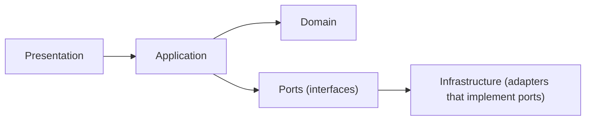
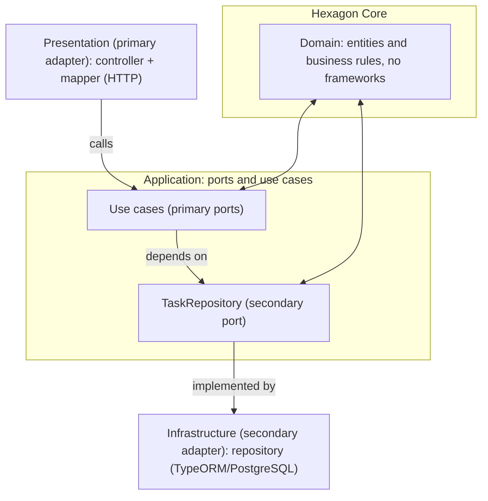
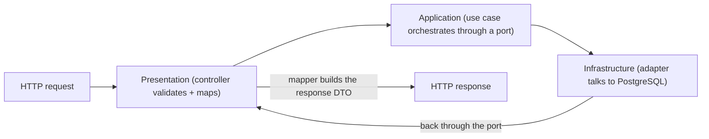

# Architecture Code

The codebase is a pnpm monorepo orchestrated with Turborepo. This doc maps the modules and boundaries, then walks through every layer of a request case by case.

## Layout

```
apps/api                 # The NestJS backend
packages/api-contract    # Shared request and response DTOs
packages/lint-config     # Shared ESLint, Prettier, dependency-cruiser config
scripts/                 # Utility scripts (node version, fixed versions)
```

## Module Boundaries

Each feature module owns four layers, and dependencies only point inward:



- `domain`: framework-free entities and rules. No NestJS, no TypeORM.
- `application`: services and ports. Depends on `domain` only.
- `infrastructure`: adapters that implement ports. Depends on `application` for the port and on `domain` for the model.
- `presentation`: controllers and mappers. Depends on `application`.

The boundary rules live in [rules/aip-repo-architecture.md](../rules/aip-repo-architecture.md).

## Hexagonal Architecture (Ports and Adapters)

The whole template follows a simple hexagonal architecture (also called ports and adapters), recorded in [ADR-0001](adrs/0001-rest-api-architecture.md). The idea: the business logic sits at the center, isolated from the outside world, and the outside world reaches it through ports and adapters.



Two kinds of ports show up in the code:

- **Primary ports** drive the application: use cases such as `CreateTaskUseCase`, called by the presentation.
- **Secondary ports** are what the application needs from outside: interfaces such as `TaskRepository`, implemented by adapters.

In this codebase the four layers map directly onto that model: `domain` is the hexagon core, `application` holds the ports and the orchestration, and `infrastructure` (persistence) and `presentation` (HTTP) are the adapters. Because the core only knows interfaces, swapping PostgreSQL for another database, or adding a CLI client, never touches the domain or the application logic. That dependency inversion is also what makes the architecture testable: tests mock the ports instead of the infrastructure.

## The Request Journey

A request crosses every layer exactly once, and each layer maps its own concern:



The rest of this doc follows the `POST /tasks` use-case through each layer.

## Case 1: The Contract

Every request and response lives in `@rebeca-hexagonal-nest-template/api-contract`. The app never defines its own DTOs.

```typescript
// packages/api-contract/src/tasks/task.request.ts
export class TaskRequest {
  @IsString()
  @IsNotEmpty()
  @MinLength(3)
  public readonly title!: string;

  @IsString()
  @IsNotEmpty()
  public readonly description!: string;
}
```

```typescript
// packages/api-contract/src/tasks/task.response.ts
export class TaskResponse {
  @IsInt()
  public id!: number;

  @IsString()
  @IsNotEmpty()
  @MinLength(3)
  public title!: string;

  @IsString()
  @IsNotEmpty()
  public description!: string;
}
```

The contract package re-exports everything from `src/index.ts`, so consumers import from the package root, never from deep paths. The class-validator decorators are used both by NestJS validation at the boundary and by the generated OpenAPI docs.

## Case 2: The Domain Model

The domain model is a plain class with no framework imports. It is what the application layer returns.

```typescript
// apps/api/src/modules/tasks/domain/task.ts
export class Task {
  public id!: number;
  public title!: string;
  public description!: string;
}
```

Tests reuse `createTaskMock()` from `domain/task.mock.ts` to build deterministic `Task` objects with sensible defaults.

## Case 3: The Port

The application layer defines what it needs as an interface, not as an implementation. The DI token lives next to the interface, so the application never imports from infrastructure. This is the seam that makes infrastructure replaceable and the service testable.

```typescript
// apps/api/src/modules/tasks/application/ports/task.repository.ts
export const TASK_REPOSITORY = 'TASK_REPOSITORY';

export interface TaskRepository {
  getTasks(): Promise<Task[]>;
  getTask(id: number): Promise<Task>;
  createTask(title: string, description: string): Promise<Task>;
  updateTask(id: number, title: string, description: string): Promise<Task>;
  deleteTask(id: number): Promise<void>;
}
```

## Case 4: The Application Use Cases

Each operation is a use case: a class that orchestrates the port for a single responsibility and exposes one `execute()` method. It holds no database or HTTP knowledge. The write operations receive an immutable command object.

```typescript
// apps/api/src/modules/tasks/application/commands/create-task.command.ts
export class CreateTaskCommand {
  public constructor(
    public readonly title: string,
    public readonly description: string
  ) {}
}
```

```typescript
// apps/api/src/modules/tasks/application/use-cases/create-task.use-case.ts
@Injectable()
export class CreateTaskUseCase {
  public constructor(@Inject(TASK_REPOSITORY) private readonly taskRepository: TaskRepository) {}

  public async execute(command: CreateTaskCommand): Promise<Task> {
    return this.taskRepository.createTask(command.title, command.description);
  }
}
```

Read operations take their arguments directly:

```typescript
// apps/api/src/modules/tasks/application/use-cases/get-tasks.use-case.ts
@Injectable()
export class GetTasksUseCase {
  public constructor(@Inject(TASK_REPOSITORY) private readonly taskRepository: TaskRepository) {}

  public async execute(): Promise<Task[]> {
    return this.taskRepository.getTasks();
  }
}
```

The application layer keeps the `TaskRepository` port in `application/ports/`. While the domain is anemic, nothing in the domain needs persistence, so the port stays out of the domain. If the domain grows rich, the interface moves there and the use cases delegate to it. See [ADR-0004](adrs/0004-application-use-cases.md).

## Case 5: The Infrastructure Adapter

The adapter implements the port against PostgreSQL using TypeORM. It works with the persistence entity and maps it to the domain model at the boundary. This keeps the domain clean and the storage shape private.

```typescript
// apps/api/src/modules/tasks/infrastructure/repositories/task.repository.adapter.ts
@Injectable()
export class TaskRepositoryAdapter implements TaskRepository {
  public constructor(private readonly dataSource: DataSource) {}

  public async createTask(title: string, description: string): Promise<Task> {
    const repository = this.dataSource.getRepository(TaskEntity);
    const entity = repository.create({ title, description });
    const saved = await repository.save(entity);
    return TaskEntityMapper.toDomain(saved);
  }
}
```

The entity is the persistence shape, with timestamps managed by TypeORM:

```typescript
// apps/api/src/modules/shared/database/entities/task.entity.ts
@Entity('tasks')
export class TaskEntity {
  @PrimaryGeneratedColumn()
  public id!: number;

  @Column()
  public title!: string;

  @Column()
  public description!: string;

  @CreateDateColumn()
  public createdAt!: Date;

  @UpdateDateColumn()
  public updatedAt!: Date;
}
```

The mapper converts between both shapes in both directions:

```typescript
// apps/api/src/modules/tasks/infrastructure/repositories/mappers/task-entity.mapper.ts
export class TaskEntityMapper {
  public static toDomain(entity: TaskEntity): Task {
    const task = new Task();
    task.id = entity.id;
    task.title = entity.title;
    task.description = entity.description;
    return task;
  }

  public static toEntity(domain: Task): TaskEntity {
    const entity = new TaskEntity();
    entity.id = domain.id;
    entity.title = domain.title;
    entity.description = domain.description;
    return entity;
  }
}
```

## Case 6: Dependency Injection

The port is bound to the adapter through a provider that NestJS resolves once, injecting the shared `DataSource`. The provider imports `TASK_REPOSITORY` from the application layer, so the dependency points from infrastructure to application, never the other way around.

```typescript
// apps/api/src/modules/tasks/infrastructure/repositories/task.repository.provider.ts
export const taskRepositoryProviders = [
  {
    provide: TASK_REPOSITORY,
    useFactory: (dataSource: DataSource): TaskRepository => new TaskRepositoryAdapter(dataSource),
    inject: [DATA_SOURCE]
  }
];
```

## Case 7: The Presentation Layer

The controller owns the HTTP contract. It validates the incoming body with the global `ValidationPipe`, delegates to the service, and maps the domain result to the response DTO.

```typescript
// apps/api/src/modules/tasks/presentation/task.controller.ts
@ApiTags('tasks')
@Controller('tasks')
export class TaskController {
  public constructor(
    private readonly getTasksUseCase: GetTasksUseCase,
    private readonly createTaskUseCase: CreateTaskUseCase
  ) {}

  @Post()
  @ApiBody({ description: '', examples: { example: { value: createTaskRequestMock() } } })
  public async createTask(@Body() request: TaskRequest): Promise<TaskResponse> {
    const task = await this.createTaskUseCase.execute(new CreateTaskCommand(request.title, request.description));
    return TaskMapper.toResponse(task);
  }
}
```

The mapper converts between the domain model and the contract DTO:

```typescript
// apps/api/src/modules/tasks/presentation/mappers/task.mapper.ts
export class TaskMapper {
  public static toResponse(task: Task): TaskResponse {
    const response = new TaskResponse();
    response.id = task.id;
    response.title = task.title;
    response.description = task.description;
    return response;
  }

  public static toDomain(request: TaskRequest): Task {
    const domain = new Task();
    domain.title = request.title;
    domain.description = request.description;
    return domain;
  }
}
```

## Case 8: Wiring the Module

The module ties the layer together with NestJS dependency injection. This is the only place where the pieces meet.

```typescript
// apps/api/src/modules/tasks/tasks.module.ts
@Module({
  imports: [DatabaseModule],
  controllers: [TaskController],
  providers: [GetTasksUseCase, GetTaskUseCase, CreateTaskUseCase, UpdateTaskUseCase, DeleteTaskUseCase, ...taskRepositoryProviders]
})
export class TasksModule {}
```

## Recap

For every feature, follow the same shape:

1. Contract DTOs in `api-contract` (request, response, mocks).
2. Plain domain model with no framework imports.
3. Port interface in `application/ports`.
4. One use case per operation in `application/use-cases`, with commands for write inputs, that depends only on the port.
5. Adapter in `infrastructure` that implements the port and maps entities at the boundary.
6. Provider that binds the port to the adapter.
7. Controller and mappers in `presentation` that own the HTTP contract.
8. Module that wires it all through dependency injection.
