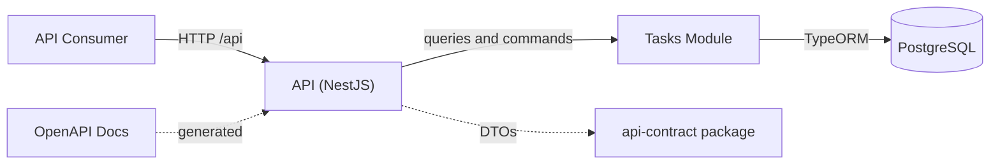

# Architecture System

The system is a single backend application (a modular monolith) backed by PostgreSQL. Consumers reach it through a REST API whose contracts are defined in a shared package.

## System Context



- **API (NestJS)**: the modular monolith exposed over HTTP.
- **Tasks Module**: the feature module with domain, application, infrastructure, and presentation layers.
- **PostgreSQL**: the persistent store, accessed only through the repository adapter.
- **api-contract**: shared request and response DTOs used by the API and any consumer.
- **OpenAPI**: generated documentation served at `/api` when `ENABLE_OPENAPI=true`.

## Containers

The backend is a single process. Inside it, NestJS modules wire together:

1. Controllers receive HTTP requests and map them to the application layer.
2. Services orchestrate domain logic through ports.
3. Adapters implement the ports against external systems (PostgreSQL through TypeORM).

## Diagrams

- [system.c4](architecture-diagrams/system.c4): the LikeC4 source for the context diagram above.
- [api-architecture.drawio.png](architecture-diagrams/api-architecture.drawio.png): the draw.io architecture overview referenced by [ADR-0001](adrs/0001-rest-api-architecture.md).

### Running the Diagrams

LikeC4 serves the diagrams in a browser with live reload on edits:

```bash
pnpm diagrams
```

Open http://localhost:5173 and edit `system.c4` to see changes immediately. To build a static version of the diagrams:

```bash
pnpm diagrams:build
```
