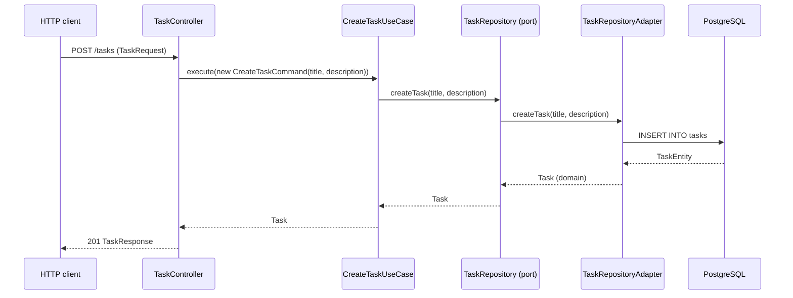

# Tasks Module

The tasks module is the reference feature module of the template. It manages tasks with full CRUD: list them, get one by id, create, update, and delete. It is deliberately simple so it shows the canonical way to structure a feature module.

## Use-Cases

| Use-case | Endpoint | Description |
|---|---|---|
| List tasks | `GET /tasks` | Returns all tasks. |
| Get a task | `GET /tasks/:id` | Returns one task by id. |
| Create a task | `POST /tasks` | Creates a task from a `TaskRequest` body. |
| Update a task | `PUT /tasks/:id` | Replaces the title and description of a task. |
| Delete a task | `DELETE /tasks/:id` | Removes a task. |

All five use cases are simple CRUD with no business rules: a request comes in, the controller validates it, the matching use case orchestrates through the repository port, and the result is mapped back to a response.

## Use-Case in Detail: Create a Task

`POST /tasks` receives a `TaskRequest` body with `title` and `description`. The request crosses every layer exactly once:



The remaining use cases follow the same simple flow. If any of them grows complex enough to deserve its own walkthrough, its sequence diagram and explanation go here, next to this one.

## Layout

```
tasks/
  ├── domain/          # Task entity, framework-free
  ├── application/     # Use cases, commands, and the TaskRepository port
  ├── infrastructure/  # TypeORM adapter and providers
  └── presentation/    # TaskController and mappers
```

For the technical walkthrough through each layer, see [architecture-code.md](../../architecture-code.md). The decision to model operations as use cases is recorded in [ADR-0004](../../adrs/0004-application-use-cases.md).
